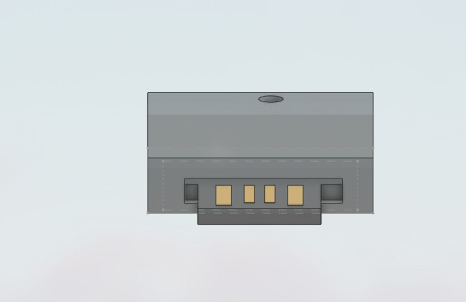

```
---
title: "Happy USB"
author: "Mihran Raza"
description: "HappyUSB a non-malicious Human Interface Device (HID) more like a pranking tool for nerds.."
created_at: "2026-06-10"
---
```

**June10**

- Started working on my past project which i paused and never started again:)
- Was in a confusion whether to build it or not as there is no custom pcb required...
- Started working on the CAD files(In Night)
- The main idea of a BAD USB is it shouldn't look suspicious to the target and to make it attractive we have to make a normal loooking case, i have a very normal looking design with a Screw to keep it in place.
- Because there is no need for any battery and the only thing we need is the port given by the module which will also be used for flashing the code, i have created this CAD, it is a very normal looking structure with a Screw hole to tighten the cover, here are the images.




- this is the design which i came up with from scracth, but i found a better design on printable which can be used with digisaprk uposn some size changes, so i'm thinking of adding that one and removing my design.
- My project got reviewed and i think it is important to design the shell or CAD ourself so i will add my CAD and the Prebuilt CAD in the repo so if someone builds this project it can use anyone of the case.
- With that my design got completed the only thing left was completing the code, which i will do tomorrow. 


**June11**

- Completed CAD files :


- Resumed from my previous work
- Reopened my old ino file where i left it, i haven't changed any features to it but it is not compiling showing errors:
  


-Which i fixed easily by surfing stackoverflow, normal error fixes, AI. With all these my project is now compiling and the software V1 is ready for publishing.

- Fixed some errors 
- Completed MVP
- Writing Readme and fixing journal
- Submission :)
- Turns out i made many mistakes making this journal and README like my images were broken i removed all the useless stuff from the journal (that was stupid) i need to add more detail, so i fixed the images now, added more details i will also add more details in README file too
- Time to get rereviewed.....
- Hope i get approved 

