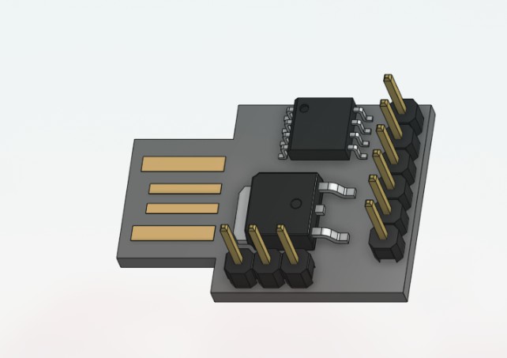
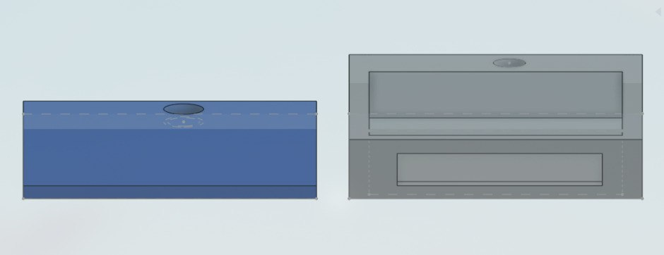
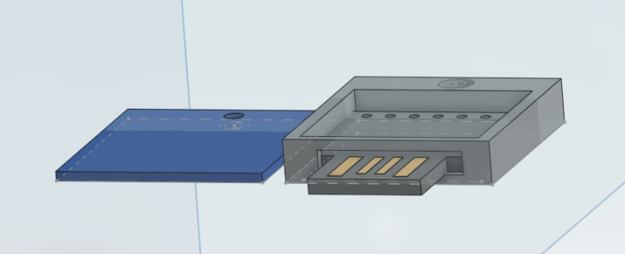
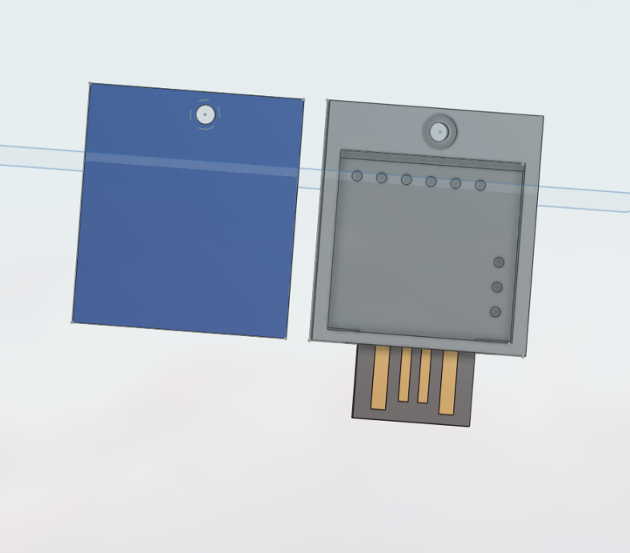

# HappyUSB
## Introduction 

HappyUSB is a non-malicious HID device inspired by BADUSB which is made for having fun with friends and pulling pranks on them. Started developing in early 25 but paused the work after some other work and never started again. Completed the project in 2.5 Days(PR). 

##  Disclaimer
This project is for educational purpose only don't use it for revenge or any other ill-inteded activity. The owner of this project is not responsible for whatever the users does with this project. Use it at your own risk and safely :)

## How it will work 
The moment it detects that the device is plug in it will:

- Volume Max
- RickRoll Launch
- Slow Mouse
- Text to Speech
- Log Out the Device
  
## Internal Workings
So Digispark is recognised as a HID (Human Interface device) tool that gives the device full access to write anything without any antivirus popping up for removing becuase the target device will think it is a human who is writing and boom that's it, pretty simple right, this simple device can be used for ill purposes so use carefully if you don't want legal trouble.

## Why the Design 
Making a shell is really important as a USB should look normal if a BADUSB look like a BADUSB who would use it inthe first place so we it is recommended to print the shell, i tried to create a very normal looking case i also found a case on printable so i added that in the files too it is also very good looking.

## BOM/Specification

- 1x [Digispark_Attiny85](https://www.amazon.in/Robodo-Electronics-ATTINY85V2-Digispark-Development/dp/B07B8SS1VQ/ref=sr_1_1?crid=1T6VZJ9D2P4XS&dib=eyJ2IjoiMSJ9.in1vS338p0_Z-CO2CZNwG09hMKSSUwdeY38edfPlTYgzW4bWAZewl3sKj7ft08IKUk3Jm5O_QjsaW8EV9b7Hh0sq9XS655OnD585np3mp3T_Tk2Sxej1vYe5i9O3ntLmiUd3on5uPcXhUVr8-OAHSGzNoIaP1DQzydRsyTGhiE_wMFcMGGKALWMksqD5usF9YaS1HgMBTlCC_P3hY2VhuGme_-wiEdJNvHtOyYzW37FYkiQCeR1GYwv0_YAtMu-DRzI-F1pI8r6u0-QYDZ8MQRoX7WwIgBoaOYOhYLmNUdc.IJWLIxMS9Dm_b4kmocab3dYmXBib45irXHmCpmBY2Is&dib_tag=se&keywords=digispark+attiny85&qid=1749896121&sprefix=digspark%2Caps%2C254&sr=8-1)

That's it you can also use a custom made USB shell available in the CAD and Production Folder there are two available options one made by me and other i found on internet :
- top.step
- Body.step

## Images

**You can also try another 3D case NOT MADE BY ME I will add that in the cad folder for you to check it out.**

## Extra Stuff

### Gratitude
- Thanks to Hackclub and Hackpad for making me do this brilliant project, More coming :).
- Thanks to my potato for helping me till the end.
- Thanks to myself for completing the project and not getting distracted with another project.
- And Thank you for Reading?

~ mihranrazaa
